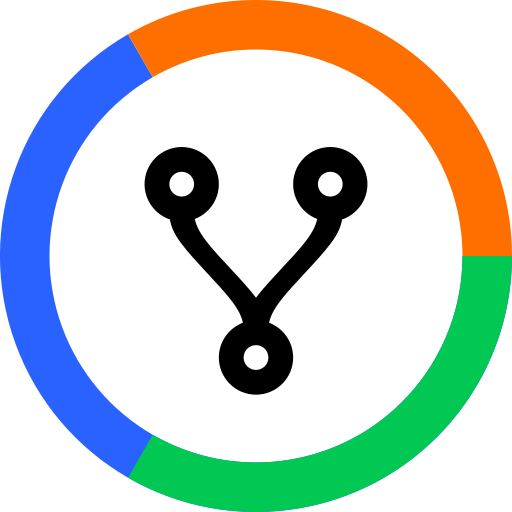

# Octostats

### Octostats is a scoreboard for you public Github repositories.

 

<h3 align="center"><a href="https://octostats.netlify.app/">Go to Octostats app &nbsp; ↗</a></h3>

### What You'll Get

- 📊 &nbsp; **Unified overview of stats** &mdash; with Octostats you will get all repo stats in one view. You can easily navigate between the dashboard and details
on individual repositories. You also get aggregated totals for all repositories, which is not available on Github.

- 🧭 &nbsp; **Choose your experience** &mdash; During authentication, you can choose if you wan to include organization repos or not. After authentication, you
can also toggle specific repositories on/off to include or exclude them from the Octostats scoreboard.

- 🔐 &nbsp; **Privacy** &mdash; Octostats does not have a dedicated backend server. It is served by Netlify and runs in the browser communicating directly with Github API.
Application developer never sees any of your data. Netlify handles exchange of authentication token during log in.

---

### Issues and Feature Requests 💬 🗯️ 🤔

If you have any issues using Octostats, use this repository as a place to submit issues and feature requests.

**[Go to issues](https://github.com/MobileFirstLLC/octostats-issues/issues)**

---

### Screenshots

**Login view**

**Octostats scoreboard**

This scoreboard gives you an overview of all activity

**Repository details**

See recent performance of individual repository

**Dark/Light mode support**

Application automatically adjusts to your device setting

**Mobile Friendly**

Also try it with your phone

* * *

**Maker:** [Mobile First](https://mobilefirst.me)  &nbsp;  
